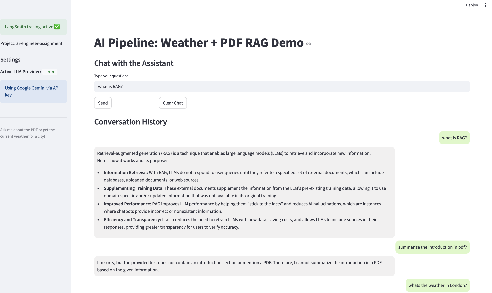
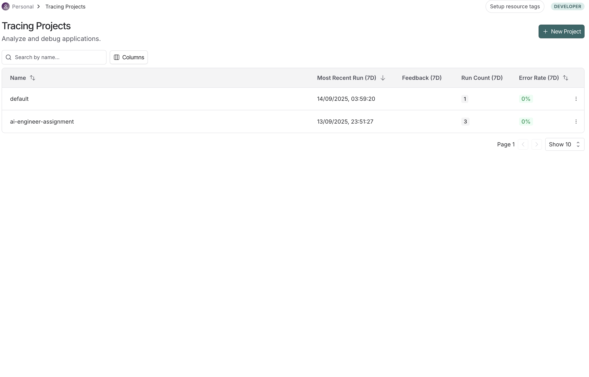
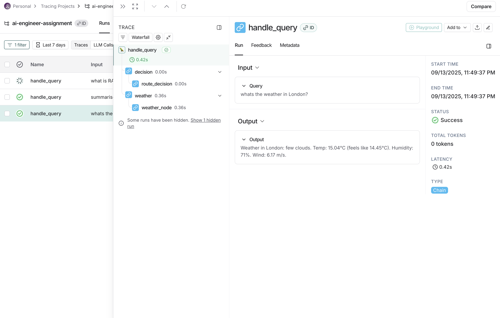
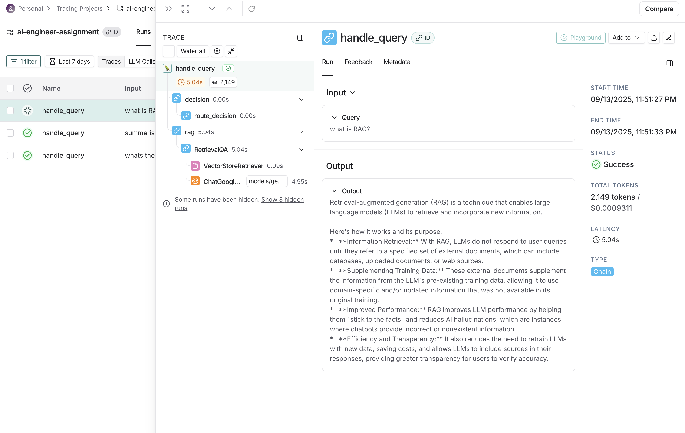
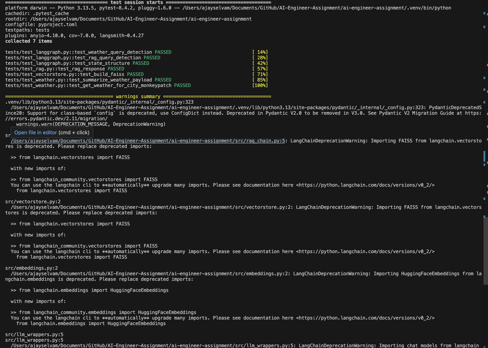

# AI Engineer Assignment

A comprehensive AI pipeline that combines weather information retrieval and RAG (Retrieval-Augmented Generation) capabilities using LangGraph for intelligent workflow orchestration.

## 🌟 Features

- 🌤️ **Weather Integration**: Get real-time weather information for any city using OpenWeather API
- 📚 **RAG Pipeline**: Ask questions about uploaded PDF documents using retrieval-augmented generation
- 🔄 **LangGraph Workflow**: Intelligent routing between weather and RAG based on query type
- 🎯 **Multiple LLM Support**: Google Gemini and OpenAI integration
- 🔧 **Modular Design**: Clean, extensible architecture with proper separation of concerns
- 🧪 **Comprehensive Testing**: Unit and integration tests with pytest
- 📊 **LangSmith Integration**: Optional tracing and monitoring capabilities
- 🚀 **Production Ready**: FastAPI backend with CORS, React frontend with TypeScript

## 🏗️ Architecture

The system uses LangGraph to create an intelligent workflow that routes queries based on content analysis:

```
START → Decision Node → [Weather Node | RAG Node] → END
```

### Core Components

- **Decision Node**: Analyzes queries to determine if they're weather-related or document-related
- **Weather Node**: Handles weather queries using OpenWeather API with LLM enhancement
- **RAG Node**: Processes document questions using retrieval-augmented generation
- **Vector Store**: FAISS-based document storage with sentence-transformers embeddings
- **LLM Wrappers**: Unified interface for multiple LLM providers (Gemini, OpenAI)

## 📋 Prerequisites

- **Python 3.13.5** (recommended) or Python 3.8+
- pip or poetry package manager
- API keys for:
  - OpenWeather API (for weather functionality)
  - Google Gemini API OR OpenAI API (for LLM functionality)
  - LangSmith API (optional, for tracing)

## 🚀 Installation & Setup

### 1. Clone the Repository

```bash
git clone <repository-url>
cd ai-engineer-assignment
```

### 2. Create Virtual Environment (Recommended)

```bash
# Using venv
python3.13 -m venv venv
source venv/bin/activate  # On Windows: venv\Scripts\activate

# Or using conda
conda create -n ai-assignment python=3.13.5
conda activate ai-assignment
```

### 3. Install Dependencies

```bash
# Install core dependencies
pip install -e .

# Or install with development dependencies
pip install -e ".[dev]"

# Alternative: Install from requirements.txt
pip install -r requirements.txt
```

### 4. Environment Configuration

Create a `.env` file in the project root:

```bash
cp env.example .env
```

Edit `.env` with your API keys:

```env
# Weather API (Required)
OPENWEATHER_API_KEY=your_openweather_api_key_here

# LLM Configuration (Required - choose one)
LLM_PROVIDER=gemini  # Options: "gemini" or "openai"

# Gemini Configuration (if using Gemini)
GEMINI_API_KEY=your_gemini_api_key_here
GEMINI_MODEL=gemini-2.5-flash

# OpenAI Configuration (if using OpenAI)
OPENAI_API_KEY=your_openai_api_key_here
OPENAI_MODEL=gpt-4o-mini

# Optional: LangSmith Integration
LANGCHAIN_API_KEY=your_langsmith_api_key_here
LANGCHAIN_PROJECT=ai-engineer-assignment

# File Paths
PDF_PATH=data/sample.pdf
FAISS_INDEX_PATH=faiss_index

# Embedding Model
EMBEDDING_MODEL=all-MiniLM-L6-v2
```

### 5. API Key Setup

#### OpenWeather API
1. Visit [OpenWeather API](https://openweathermap.org/api)
2. Sign up for a free account
3. Get your API key from the dashboard

#### Google Gemini API
1. Visit [Google AI Studio](https://makersuite.google.com/app/apikey)
2. Create a new API key
3. Add it to your `.env` file

#### OpenAI API (Alternative)
1. Visit [OpenAI Platform](https://platform.openai.com/api-keys)
2. Create a new API key
3. Add it to your `.env` file

## 🎯 Usage

### Option 1: Streamlit App (Quick Start)

```bash
# Run the Streamlit application
streamlit run src/app.py
```

Access the app at `http://localhost:8501`

### Option 2: Development Mode with Make

```bash
# Set up development environment
make setup

# Run the Streamlit app
make run

# Run tests
make test

# Run tests with coverage
make test-cov

# Format code
make format

# Run all quality checks
make check
```

### Option 3: Using the API Programmatically

```python
import sys
import os
sys.path.append('src')

from src.langgraph_engine import LangGraphEngine
from src.llm_wrappers import get_llm
from src.rag_chain import build_rag_chain
from src.vectorstore import load_faiss
from src.embeddings import get_embeddings

# Initialize components
llm = get_llm()
embeddings = get_embeddings()
vectorstore = load_faiss("faiss_index", embeddings)
rag_chain = build_rag_chain(llm, vectorstore)

# Create engine
engine = LangGraphEngine(
    rag_chain=rag_chain, 
    llm=llm, 
    openweather_api_key="your_api_key"
)

# Query the system
response = engine.handle("What's the weather in London?")
print(response)

response = engine.handle("What is RAG?")
print(response)
```

## 📁 Project Structure

```
ai-engineer-assignment/
├── src/                     # Core source code
│   ├── __init__.py
│   ├── app.py              # Streamlit application
│   ├── config.py           # Configuration management
│   ├── data_loader.py      # PDF loading and text splitting
│   ├── embeddings.py       # Embedding model management
│   ├── langgraph_engine.py # LangGraph workflow orchestration
│   ├── llm_wrappers.py     # LLM provider abstractions
│   ├── rag_chain.py        # RAG chain implementation
│   ├── vectorstore.py      # FAISS vector store operations
│   └── weather.py          # Weather API integration
├── tests/                   # Test suite
│   ├── __init__.py
│   ├── conftest.py         # Pytest configuration and fixtures
│   ├── test_langgraph.py   # LangGraph workflow tests
│   ├── test_rag.py         # RAG functionality tests
│   ├── test_vectorstore.py # Vector store tests
│   └── test_weather.py     # Weather API tests
├── data/                    # Data files
│   └── sample.pdf          # Sample PDF for RAG
├── faiss_index/            # FAISS index storage
│   ├── index.faiss
│   └── index.pkl
├── scripts/                 # Development scripts
│   ├── start-dev.sh        # Linux/Mac development startup
│   └── start-dev.bat       # Windows development startup
├── pyproject.toml          # Project configuration
├── requirements.txt         # Python dependencies
├── Makefile                # Development commands
├── nginx.conf              # Nginx configuration
├── .env.example            # Environment template
└── README.md               # This file
```

## 🔧 Development

### Running Tests

```bash
# Run all tests
pytest

# Run with coverage
pytest --cov=src --cov-report=html

# Run specific test categories
pytest -m unit          # Unit tests only
pytest -m integration   # Integration tests only
pytest -m "not slow"    # Skip slow tests

# Run specific test file
pytest tests/test_weather.py
```

### Code Quality

```bash
# Format code
black src tests
isort src tests

# Lint code
flake8 src tests
mypy src

# Run all quality checks
make check
```

### Adding New Features

1. **New LLM Providers**: Add wrappers in `src/llm_wrappers.py`
2. **New Data Sources**: Extend the data loading in `src/data_loader.py`
3. **New LangGraph Nodes**: Add processing nodes to `src/langgraph_engine.py`
4. **New Vector Stores**: Extend vector store operations in `src/vectorstore.py`

## 🧪 Testing Strategy

The project includes comprehensive testing:

- **Unit Tests**: Test individual components in isolation
- **Integration Tests**: Test component interactions
- **Mocking**: External API calls are mocked for reliable testing
- **Fixtures**: Shared test data and configurations

### Test Categories

- `@pytest.mark.unit`: Fast, isolated unit tests
- `@pytest.mark.integration`: Tests requiring external dependencies
- `@pytest.mark.slow`: Tests that take longer to run

## 🔍 Implementation Details

### LangGraph Workflow

The core intelligence lies in the LangGraph workflow:

```python
class GraphState(TypedDict):
    query: str
    response: str
    city: str
    weather_data: Dict[str, Any]
    is_weather_query: bool
    rag_chain: Any
    llm: Any
    openweather_api_key: str
```

**Decision Logic**: Uses keyword matching to classify queries:
- Weather keywords: `{"weather", "temperature", "rain", "forecast", "sunny", "wind", "windy", "snow", "cloud"}`
- City extraction: Regex patterns to extract city names from queries

### RAG Implementation

- **Document Processing**: PDFs are loaded and split using `RecursiveCharacterTextSplitter`
- **Embeddings**: Uses `sentence-transformers` with `all-MiniLM-L6-v2` model
- **Vector Store**: FAISS for efficient similarity search
- **Retrieval**: Top-k document retrieval with configurable chunk size

### Weather Integration

- **API**: OpenWeather API for real-time weather data
- **Enhancement**: LLM-generated summaries for natural language responses
- **Error Handling**: Comprehensive error handling with user-friendly messages

### Configuration Management

Uses `pydantic-settings` for type-safe configuration:
- Environment variable loading
- Default values
- Validation
- Type hints

## 🚨 Troubleshooting

### Common Issues

1. **Import Errors**
   ```bash
   # Ensure you're in the project root and package is installed
   pip install -e .
   ```

2. **API Key Errors**
   ```bash
   # Verify your .env file has correct API keys
   cat .env
   ```

3. **PDF Loading Issues**
   ```bash
   # Ensure PDF exists and is not corrupted
   ls -la data/sample.pdf
   ```

4. **Memory Issues**
   ```bash
   # For large PDFs, consider using a smaller embedding model
   # Update EMBEDDING_MODEL in .env
   ```

5. **LangGraph Import Errors**
   ```bash
   # Ensure LangGraph is installed
   pip install langgraph>=0.0.40
   ```

### Debug Mode

Enable debug logging:

```python
import logging
logging.basicConfig(level=logging.DEBUG)
```

## 📊 Performance Considerations

- **Embedding Model**: `all-MiniLM-L6-v2` provides good balance of speed and quality
- **Chunk Size**: Default 1000 characters with 200 overlap for optimal retrieval
- **Top-K Retrieval**: Default 4 documents for context
- **Caching**: Streamlit caches the pipeline initialization

## 🤝 Contributing

1. Fork the repository
2. Create a feature branch: `git checkout -b feature-name`
3. Make your changes
4. Add tests for new functionality
5. Ensure all tests pass: `make test`
6. Run quality checks: `make check`
7. Commit your changes: `git commit -m "Add feature"`
8. Push to the branch: `git push origin feature-name`
9. Submit a pull request

## 📄 License

MIT License - see LICENSE file for details.

## 🙏 Acknowledgments

- [LangChain](https://langchain.com/) for the RAG framework
- [LangGraph](https://github.com/langchain-ai/langgraph) for workflow orchestration
- [OpenWeather](https://openweathermap.org/) for weather data
- [Google Gemini](https://ai.google.dev/) and [OpenAI](https://openai.com/) for LLM capabilities
- [FAISS](https://github.com/facebookresearch/faiss) for vector similarity search
- [Streamlit](https://streamlit.io/) for the web interface


## 📡 LangSmith Integration Evidence

The project is fully integrated with **LangSmith** for tracing and observability.

### Screenshot 1 – Streamlit App Sidebar Confirmation
Shows that **LangSmith tracing is active** and the project is set to `ai-engineer-assignment`.



*Caption:*  
✅ *Sidebar showing successful LangSmith activation in the running Streamlit app.*

---

### Screenshot 2 – LangSmith Project Dashboard
Displays the `ai-engineer-assignment` project in LangSmith with recent runs, latency metrics, and tracing activity.



*Caption:*  
📊 *LangSmith dashboard with project `ai-engineer-assignment` automatically created and populated with traces.*

---

### Screenshot 3 – Individual Run Trace
Detailed view of one run inside LangSmith, showing the **input query, intermediate steps, and LLM output**.





*Caption:*  
🔍 *Example of a single trace in LangSmith, demonstrating end-to-end observability of the pipeline.*

## Unit Test Results

The project includes comprehensive unit tests.  
Below is a screenshot showing all tests passing:



